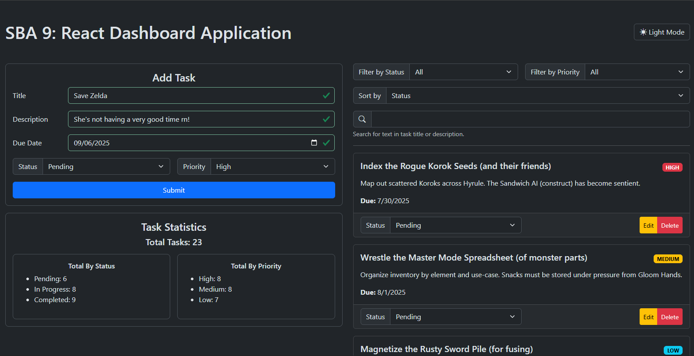

# SBA 9: React Dashboard Application

[Karl Johnson](https://github.com/hirekarl)  
2025-RTT-30  
<time datetime="2025-07-28">2025-07-28</time>  



## Overview
### Viewer Instructions
1. Run the following in the terminal:

```bash
cd task-dashboard && npm i && npm run dev
```

2. Navigate to http://localhost:5173 in the browser.

### Submission Source
Top-level app behavior can be found in [`./task-dashboard/src/App.tsx`](./task-dashboard/src/App.tsx).

### Reflection
Write a reflection addressing:
- How you implemented React and TypeScript features
- The challenges you encountered and how you overcame them
- Your approach to component composition and state management

> I implemented TypeScript features by declaring types in [`./task-dashboard/src/types/index.ts`](./task-dashboard/src/types/index.ts) and using type annotations throughout my project. React features were implemented using React functional components and the [React Bootstrap](https://react-bootstrap.netlify.app/) library for the `TaskEditModal` component.
>
> The main challenge was form validation, only because it was very tedious and I had to implement everything twice, since I used a separate form component for the modal. I overcame them by pushing through. With more time, I'd try to figure out how to render the forms without registering initially as invalid. I started trying to work with transition animations and ultimately gave up on it for this submission; I need to learn more about `useRef` and the React rendering pipeline to be able to use [React Transition Group](https://reactcommunity.org/react-transition-group/) and its utilities properly. I also decided not to implement task reordering, since it would involve completely restructuring how I was doing filtering and sorting.
>
> I decided to handle tasks, filters, sort categories, and modal state on the root `Dashboard` component and passed down callbacks to lift state changes from child components. I implemented task search as a part of the `TaskFilter` component, and handled all the task filtering (matching against applied filters and the search term lifted from the search input) with the `filterTasks` method on `Dashboard`.

## Assignment
In this assessment, you will apply the skills you have developed throughout your React training to build a functional, real-world dashboard application. This project will test your understanding of React components, state management, TypeScript integration, form handling, and component composition.

You will create a **Task Management Dashboard** using React and TypeScript. The final deliverable will include a GitHub repository with your project and a written reflection on your approach and the challenges you faced.
